# Market Data Backtester with Execution and Risk Modeling — Project Plan

## 1. Goal

Build an auditable, deterministic market-replay platform in C++ that transforms point-in-time market data into signals, orders, fills, portfolio state, PnL, and risk reports under explicit execution assumptions. Python is used only for one-time data acquisition and final report visualization.

## 2. Motivation ("Why do this")

- **Prediction is not PnL.** A successful forecast can become unprofitable after position sizing, turnover, spread, fees, market impact, and risk constraints.
- **Backtests fail silently.** Same-bar fills, adjusted execution prices, stale marks, and future-derived universes can create plausible but false performance.
- **It mirrors quant work.** The project integrates market data, time-series reasoning, order simulation, accounting, risk, validation, and performance engineering.
- **It is more credible than a flashy model.** Quant SWE reviewers typically value deterministic behavior, testable invariants, domain modeling, and measured speed.
- **C++ raises the bar.** A native-code engine with explicit memory management, zero-copy Parquet I/O, and measured microsecond-level throughput demonstrates systems-level competence that a Python-only project cannot.
- **It creates a strong interview narrative.** Every design choice produces useful discussion: timing semantics, partial fills, impact assumptions, accounting, statistical validation, and optimization.
- **It is reusable.** The same interfaces can later support new strategies, asset classes, quote/order-book data, or live paper trading.

## 3. Requirements Analysis

### 3.1 What the project must demonstrate

The product is not merely a profitable strategy: it is a trustworthy experimental system. Reviewers should see evidence of financial correctness, execution realism, research discipline, software quality, and performance awareness.

### 3.2 Primary failure risks

- Look-ahead and survivorship bias.
- Incorrect timestamp or corporate-action handling.
- Same-bar fills and unrealistic execution assumptions.
- Incorrect cash, position, or PnL accounting.
- Overfitting and reporting only favorable results.
- Untestable code hidden inside a notebook or script.

### 3.3 Architectural implications

- Use a modular monolith with a custom, deterministic event-driven simulation kernel in C++.
- Use a hybrid model:
  - Batch array operations (Eigen or raw loops over contiguous vectors) for feature computation.
  - Event-driven processing for orders, fills, accounting, and risk.
- Keep provider, strategy, execution, and risk implementations behind abstract interfaces (virtual base classes or compile-time polymorphism via templates).
- Python is used strictly as a data-fetch script and a report-rendering script — it is not part of the engine, build, or test pipeline.

### 3.4 Scope

- USD-denominated liquid US ETFs.
- A fixed, predeclared universe of 5 ETFs: **SPY, QQQ, IWM, TLT, GLD**. All existed well before the evaluation period (2019–2024). This is small enough to reason about by hand but diverse enough (large-cap equity, small-cap, bonds, commodities) to show cross-asset behavior.
- **Daily bars, daily signals, next-bar-open execution.** The strategy observes a completed daily bar after the close, generates target positions, and orders execute at the next day's open. No minute-bar data is required for the MVP.
- Market and limit orders, partial fills, DAY/GTC handling, commissions, spread, slippage, latency, and volume-participation limits.
- One account, one base currency (USD), starting capital $1,000,000.
- Data source: **yfinance** (free, no API key, sufficient for daily OHLCV + adjusted close). Data is fetched once by a Python script and stored as Parquet files read by C++.

### 3.5 Recommended MVP scope

A synthetic, checked-in fixture dataset (5 symbols × 10 bars, hand-crafted) for CI and known-answer tests, plus the yfinance-fetched real dataset (5 symbols × ~1500 bars, gitignored) for showcase experiments.

### 3.6 Explicit non-goals for the first release

- Exact exchange queue-position or Level-3 order-book simulation.
- Options, futures, multicurrency settlement, or live capital.
- Minute-bar or intraday data and execution.
- A web dashboard before the engine is validated.
- Claiming market-microstructure fidelity that OHLCV data cannot support.
- Python bindings or a Python-callable API (the engine is a standalone C++ binary).

### 3.7 Quant-screening evidence required

| Screening dimension | Required project evidence |
|---|---|
| Financial correctness | Explicit event timing, no-look-ahead tests, PnL reconciliation, corporate-action policy |
| Execution realism | Order lifecycle, spread, fees, slippage, impact, latency, partial fills, participation limits |
| Research rigor | Chronological validation, benchmarks, cost sensitivity, trial logging, honest limitations |
| Software engineering | Typed modules, clean APIs, CI, unit/property/integration tests, reproducible CLI |
| Performance | Fixed benchmark, profiling, measured throughput and memory, optimization without changing results |
| Communication | Strong README, architecture diagram, one-command demo, sample report, quantified resume bullets |

## 4. Core Objectives

- Ingest, normalize, validate, and version historical market data.
- Prevent future information from entering features, signals, or fills.
- Simulate market and limit orders through a deterministic event engine.
- Model transaction costs, spread, latency, impact, partial fills, and liquidity constraints.
- Maintain a reconciled source-of-truth ledger for cash, positions, realized/unrealized PnL, and fees.
- Apply pre-trade limits and calculate post-trade risk and performance metrics.
- Reproduce every experiment from a versioned configuration, dataset hash, code revision, and random seed.
- Demonstrate measured correctness and speed rather than relying on a high Sharpe ratio.

## 5. Development Process

### 5.1 Step 1 — Start with a simulation contract

Create `docs/simulation_contract.md` before writing engine code. Define:

- **Bar timestamp convention:** the timestamp on a daily bar represents the trading session date. The bar is complete (all OHLCV fields finalized) at market close (16:00 ET). `event_ts` = session close time. `available_ts` = session close time (the strategy may observe the bar only after the close).
- **Same-timestamp event priority:** when multiple events share the same `available_ts`, process in this order: (1) corporate actions, (2) market data bars, (3) fill events, (4) mark-to-market, (5) strategy signals, (6) new orders. This is encoded as an integer priority in the event struct.
- **Order eligibility:** an order generated from bar *t*'s data becomes eligible for execution at bar *t+1*'s open. A signal calculated from bar *t* can never fill using bar *t*.
- **Market order semantics:** fill at the next eligible bar's open price (plus costs).
- **Limit order semantics:** fill if the next eligible bar's price range [low, high] crosses the limit price. Fill price = limit price (plus costs). If the open itself crosses the limit, fill at open.
- **Mark-to-market price:** the close price of the most recent completed bar.
- **Missing/stale-data behavior:** if a symbol has no bar for a trading day, carry forward the previous close for marking and skip execution for that symbol. Log a warning.
- **Corporate-action policy:** use yfinance's adjusted close to compute split/dividend-adjusted returns for signal computation. Raw close is used for fill prices and accounting. Log any bar where `close != adjusted_close` (indicates a corporate action in the history).
- **Accounting precision:** use IEEE 754 `double` throughout. Reconciliation tolerance: `|NAV_computed - NAV_expected| < $0.01` for known-answer tests.
- **Deterministic RNG:** use `std::mt19937_64` seeded from the run configuration. Every stochastic component (slippage sampling) draws from a single, deterministic sequence.

### 5.2 Step 2 — Build a thin end-to-end slice first

Use a tiny synthetic dataset (5 symbols × 10 bars, checked into `tests/fixtures/`) to complete:

```text
Market data -> feature -> signal -> target position -> risk check
  -> order -> execution -> fill -> ledger -> PnL -> report
```

The first scenario has a hand-calculated expected result for every intermediate output. Do not begin by independently building every subsystem.

### 5.3 Step 3 — Stack

- **Language:** C++20 (g++ 13+)
- **Build system:** CMake 3.20+
- **Columnar I/O:** Apache Arrow C++ / Parquet C++ (bundled with pyarrow's pip install — headers and shared libs in the venv)
- **Configuration:** YAML via yaml-cpp
- **Math/numerics:** `<cmath>`, `<numeric>`, `<algorithm>` from the standard library; Eigen if matrix operations become necessary for portfolio optimization
- **Testing:** Google Test + Google Benchmark
- **Quality:** clang-tidy, clang-format, GitHub Actions CI
- **Logging:** spdlog or a minimal custom structured logger writing JSON lines
- **Data fetch (Python):** yfinance + pyarrow, run once to produce Parquet files
- **Report visualization (Python):** matplotlib or plotly, reads CSV/JSON outputs from a completed run, generates static HTML
- **Python environment:** `/home/yash7312/Desktop/2026_autumn/.venv/` (Python 3.12, pyarrow 25, yfinance)

### 5.4 Step 4 — Showcase experiment

The initial experiment:

- **Universe:** SPY, QQQ, IWM, TLT, GLD (5 liquid ETFs, all existed before 2019).
- **Data range:** 2019-01-02 to 2024-12-30 (~1509 trading days per symbol).
- **Signal:** cross-sectional volatility-scaled momentum. For each symbol: compute 12-month (252-day) trailing return, skip the most recent 1 month (21 days) to avoid short-term reversal, divide by trailing 63-day realized volatility. Rank across the universe. Go long the top 2, short the bottom 2, skip the middle. Target equal risk-contribution weights within each leg.
- **Signal availability:** after session close on day *t*.
- **Execution:** market orders at day *t+1*'s open.
- **Rebalancing:** weekly (every Monday, or next trading day if Monday is a holiday).
- **Comparison ladder:**
  1. Reference: next-open fills, zero costs.
  2. Spread only: half-spread crossing cost.
  3. Spread + commissions: $0.005/share commission.
  4. Full: spread + commissions + square-root impact + 1-bar latency.
- **Benchmark:** SPY buy-and-hold, equal-weight buy-and-hold of all 5 ETFs.
- **Evaluation periods:** 2019-01 to 2021-12 training (signal parameter selection), 2022-01 to 2023-06 validation (model selection), 2023-07 to 2024-12 test (locked, reported once).

### 5.5 Step 5 — Data and project governance

- Do not commit fetched market data. The `data/raw/` directory is gitignored.
- Check in synthetic fixture data under `tests/fixtures/` for CI.
- Record the provider, symbols, date range, schema version, and content SHA-256 hash in every run manifest.
- Validate correctness via the adversarial test suite (§7 item 12). The suite is designed to surface the same class of errors an external reviewer would catch: look-ahead bugs, accounting violations, fill impossibilities, and determinism failures.

## 6. Architecture

### 6.1 Architecture style

Use a modular monolith with abstract interfaces and a deterministic event-driven core:

- **Modular monolith:** easier to debug, test, profile, and reproduce than microservices or inter-process designs.
- **Custom event kernel:** exposes the financial mechanics reviewers want to inspect.
- **Batch computation path:** contiguous `std::vector<double>` and rolling-window loops for features and signals. No per-element heap allocation in hot paths.
- **Sequential simulation path:** orders, fills, portfolio state, and risk are processed causally through the event queue.
- **Append-only ledgers:** every order, fill, cash movement, position change, and rejection remains auditable via `std::vector` logs written to Parquet at run end.
- **Abstract interfaces:** `IStrategy`, `IExecutionModel`, `IRiskRule`, `IDataFeed` — concrete implementations are injected at configuration time.

### 6.2 Logical architecture

```mermaid
flowchart LR
    DS[yfinance Python script] --> RAW[(Parquet files on disk)]
    RAW --> LOAD[C++ Parquet reader]
    LOAD --> NV[Normalize, validate, calendar-check]
    NV --> CAT[In-memory bar store]

    CAT --> FT[Feature pipeline]
    CAT --> FEED[Chronological bar feed]
    FT --> FEED

    CFG[YAML config] --> RUN[Experiment runner]
    RUN --> K[Deterministic event kernel]
    FEED --> K

    K --> EX[Execution model]
    EX --> FILL[Fill events]
    FILL --> LEDGER[Portfolio & accounting ledger]

    K --> ST[Strategy]
    ST --> SZ[Target construction & sizing]
    SZ --> PR[Pre-trade risk]
    PR --> OMS[Order management]
    OMS --> EX

    LEDGER --> POST[Post-trade risk snapshots]
    LEDGER --> AN[Analytics & attribution]
    POST --> AN

    RUN --> ART[(Run artifacts: Parquet, JSON, CSV)]
    AN --> ART

    ART --> VIZ[Python report script → HTML]
```



### 6.3 Module boundaries

| Module | Primary responsibility | Important contract |
|---|---|---|
| `domain` | Instruments, events, orders, fills, positions, enums, timestamps | Immutable value types. No I/O or business logic. All other modules depend on this. |
| `data` | Parquet reader, bar validation, calendar checks, in-memory store | Emits ordered, point-in-time `Bar` records. Detects gaps, duplicates, and outliers. |
| `features` | Rolling computations over bar vectors: returns, volatility, momentum | Every feature function takes a lookback window and returns a value computable from data available at `available_ts`. No allocation per bar. |
| `engine` | Clock, event queue (priority_queue), event dispatch, orchestration loop | No future event or state can be observed. Deterministic: same config+data+seed → identical event sequence. |
| `strategy` | Convert available features into target portfolio weights | Read-only: receives const references to features and current portfolio. Returns a `TargetPortfolio`. Never mutates state. |
| `portfolio` | Cash, holdings, marks, average cost, realized/unrealized PnL, NAV | Enforces `NAV = cash + Σ(quantity × mark_price)` after every mutation. Append-only ledger of all entries. |
| `risk` | Pre-trade projected checks, post-trade snapshot metrics | Accept, resize, or reject each order with an explicit `RiskDecision` carrying a reason code. |
| `execution` | Order state machine, fill generation, cost models (spread, fees, impact) | Only orders active before a bar's timestamp are eligible to fill using that bar. Produces `Fill` events. |
| `analytics` | Performance metrics, cost attribution, per-symbol breakdowns | Reads completed ledger and fill logs. Computes Sharpe, drawdown, etc. Does not modify simulation state. |
| `experiments` | YAML config parsing, run manifests, artifact serialization | Every result is tied to config hash, data hash, git SHA, and seed. Writes Parquet/JSON/CSV outputs. |

### 6.4 Event processing order per bar

For each new daily bar arriving in chronological order:

1. Apply any corporate-action adjustments for this date.
2. Process only orders that were submitted before this bar's open (eligible orders).
3. Generate fills: check market orders against bar open; check limit orders against bar [low, high].
4. Apply fills to the portfolio ledger (update cash, positions, realized PnL).
5. Mark all positions to this bar's close price. Compute NAV. Record post-trade risk snapshot.
6. Release the completed bar and its point-in-time features to the strategy.
7. Strategy produces new target weights (if this is a rebalance day).
8. Sizing: convert target weights to share quantities given current NAV.
9. Pre-trade risk: check each proposed order against limits. Accept, resize, or reject.
10. Queue accepted orders with submission timestamp = this bar's close. They become eligible at the next bar's open.

This prevents a strategy from observing a completed bar and then receiving a favorable fill inside that same bar.

### 6.5 Execution-model ladder

**1. Reference model**
- Fill at next eligible bar's open price.
- No fees, no impact, no spread.
- Used for known-answer tests and as a differential baseline.

**2. Realistic bar model (MVP target)**
- Fill at next eligible bar's open price.
- Half-spread crossing cost: `spread = 0.01%` of price (configurable).
- Commission: `$0.005/share` (configurable).
- Deterministic slippage: seeded uniform draw from `[0, max_slip]` where `max_slip` is configurable.
- Square-root market impact:
  ```
  impact = eta * p_ref * sigma_trailing * sqrt(q / ADV_trailing)
  p_fill = p_ref + side_sign * (spread/2 + impact)
  ```
  where `eta = 0.1` (configurable), `sigma_trailing` = 21-day trailing volatility, `ADV_trailing` = 21-day average daily volume, `side_sign` = +1 for buys, −1 for sells. All trailing inputs use data available before the order.
- Partial fills: if order quantity > `participation_cap * bar_volume`, fill only `participation_cap * bar_volume` shares. `participation_cap = 0.05` (5%, configurable). Remainder stays active for the next eligible bar.
- Latency: configurable delay (default 0 for daily bars — order submitted at close, eligible at next open).

**3. Future extensions (not claimed for MVP)**
- NBBO touch fills, quote latency, queue and venue models.

### 6.6 Repository layout

```text
qback/
├── CMakeLists.txt
├── README.md
├── .gitignore
├── configs/
│   ├── default.yaml
│   └── research.yaml
├── docs/
│   ├── simulation_contract.md
│   └── architecture.md
├── scripts/
│   ├── fetch_data.py          # Python: one-time data download
│   └── report.py              # Python: generate HTML report from run artifacts
├── data/
│   └── raw/                   # Parquet files (gitignored)
├── src/
│   └── qback/
│       ├── main.cpp
│       ├── domain/
│       │   ├── bar.h / bar.cpp
│       │   ├── order.h
│       │   ├── fill.h
│       │   ├── position.h
│       │   ├── event.h
│       │   └── types.h        # Enums: Side, OrderType, OrderStatus, TIF, EventType
│       ├── data/
│       │   ├── parquet_reader.h / parquet_reader.cpp
│       │   └── bar_store.h / bar_store.cpp
│       ├── features/
│       │   └── rolling.h / rolling.cpp
│       ├── engine/
│       │   ├── clock.h
│       │   ├── event_queue.h
│       │   └── engine.h / engine.cpp
│       ├── strategy/
│       │   ├── strategy.h      # IStrategy interface
│       │   ├── buy_and_hold.h / buy_and_hold.cpp
│       │   └── momentum.h / momentum.cpp
│       ├── portfolio/
│       │   ├── ledger.h / ledger.cpp
│       │   └── position_tracker.h / position_tracker.cpp
│       ├── risk/
│       │   ├── risk_rule.h     # IRiskRule interface
│       │   └── limits.h / limits.cpp
│       ├── execution/
│       │   ├── execution_model.h  # IExecutionModel interface
│       │   ├── reference_model.h / reference_model.cpp
│       │   ├── realistic_model.h / realistic_model.cpp
│       │   └── oms.h / oms.cpp
│       ├── analytics/
│       │   └── metrics.h / metrics.cpp
│       └── experiments/
│           ├── config.h / config.cpp
│           └── runner.h / runner.cpp
└── tests/
    ├── unit/
    ├── integration/
    ├── e2e/
    ├── fixtures/              # Synthetic Parquet + expected-result JSONs
    └── benchmarks/
```

### 6.7 Run-artifact contract

```text
runs/<run_id>/
├── config.yaml                # Exact config used
├── manifest.json              # Git SHA, data hashes, seed, compiler, timestamp
├── orders.csv                 # All order submissions
├── fills.csv                  # All fill events
├── ledger.csv                 # All cash/position mutations
├── nav.csv                    # Daily NAV, cash, gross/net exposure
├── risk.csv                   # Daily risk snapshots
├── metrics.json               # Summary statistics
└── report.html                # Generated by scripts/report.py
```

CSV is used for run artifacts (human-readable, diffable, trivially consumed by Python for reporting). Parquet is used for input market data (efficient columnar reads in C++).

## 7. Implementation Roadmap

`P0` items must be complete before the project is presented. `P1` items are enhancements.

| # | Priority | Implementation and acceptance | Quant-screening justification |
|---|---|---|---|
| 1 | P0 | **Simulation contract:** document timestamp semantics, event priority, fill eligibility, mark policy, missing data, corporate actions, and accounting conventions. Add a test proving that a close-based signal cannot fill at that same close. | Ambiguous timing is the most common reason a backtester is not credible. |
| 2 | P0 | **Reproducible project skeleton:** CMake build, C++20, Google Test, clang-format, CI, YAML config, structured logging, run manifests. `cmake -B build && cmake --build build && ./build/qback_tests` must pass from a clean clone. | Demonstrates production-oriented C++ and reproducibility. |
| 3 | P0 | **Known-answer vertical slice:** synthetic bars → signal → target → order → fill → ledger → metrics. Compare every output with a hand-calculated fixture. | Produces a working system early and validates all integration boundaries. |
| 4 | P0 | **Point-in-time data pipeline:** Parquet reader, bar validation, calendar-gap detection, dataset hashing, `event_ts`/`available_ts` enforcement. | Shows financial-data engineering and directly addresses look-ahead, timezone, and data-lineage failures. |
| 5 | P0 | **Deterministic event kernel:** chronological bar feed, priority queue with stable key `(timestamp, priority, sequence)`, seeded RNG injection. Repeat runs produce identical ledgers (hash-verified). | Event ordering, causality, and deterministic replay are central Quant SWE signals. |
| 6 | P0 | **Portfolio and accounting ledger:** cash, positions, average cost, realized/unrealized PnL, marks, fees. Enforce `NAV = cash + Σ(quantity × mark)` and position-delta/fill reconciliation as a hard assertion. | Accounting errors invalidate every performance metric; a tested ledger is one of the strongest project differentiators. |
| 7 | P0 | **OMS and execution simulation:** order state machine (New→Submitted→Active→Filled/PartialFill/Cancelled/Rejected), market/limit orders, TIF, partial fills, participation caps, commissions, spread, square-root impact. Complete order-to-fill audit trail. | Converts the project from a signal calculator into a realistic trading simulator. |
| 8 | P0 | **Sizing and risk controls:** translate target weights into share quantities, then enforce per-name concentration, gross/net exposure, leverage, cash reserve, max order size, and turnover limits. Reject or resize with reason codes. | Shows separation among strategy, portfolio construction, risk, and execution. |
| 9 | P0 | **Strategy adapters:** buy-and-hold baseline + volatility-scaled cross-sectional momentum (12-1 month, vol-normalized, long top 2 / short bottom 2). Strategies return `TargetPortfolio`; they never mutate positions. | Keeps focus on evaluation quality and makes strategy behavior independently testable. |
| 10 | P0 | **Research protocol:** chronological train (2019–2021) / validation (2022–mid 2023) / test (mid 2023–2024) split. Cost-model ablation across the 4-rung execution ladder. Benchmark vs SPY and equal-weight buy-and-hold. | Addresses overfitting, data snooping, and unsupported Sharpe claims. |
| 11 | P0 | **Analytics and reporting:** Sharpe, Sortino, max drawdown, annualized return/vol, beta, cost attribution (commission/spread/impact), execution quality (fill rate, implementation shortfall), per-symbol breakdowns. Python script generates static HTML report. | Gives reviewers an interpretable result derived from auditable state. |
| 12 | P0 | **Adversarial test suite:** unit (Google Test), integration, end-to-end, and regression tests. Scenarios: future-data perturbation, no-trade, zero-return, round-trip fee, partial-fill, limit-crossing, stale-price, determinism (run twice, compare hashes). | Tests invariants and failure modes rather than merely achieving a coverage percentage. |
| 13 | P0 | **Performance benchmark:** benchmark the full 5-symbol × 1509-bar dataset. Measure events/sec, peak RSS, total wall time. Profile with `perf` and `valgrind --tool=callgrind`. Confirm optimized build matches reference-model ledger. | Quant SWE screening expects measured performance and disciplined optimization. |
| 14 | P0 | **Screening package:** concise README, architecture diagram, quickstart (`make demo`), example report, benchmark table, test badge, stated limitations, quantified resume bullets. | Recruiters may spend under a minute on the repository; evidence must be immediately visible. |
| 15 | P1 | **Extensions:** SIMD-optimized feature loops, lock-free event queue, NBBO/L2 replay if quote data is sourced, additional strategies (mean reversion, factor-neutral). | Adds specialization without delaying the correctness-focused core. |

### Critical path

```text
Simulation contract (Layer 1)
  → Domain model + test framework (Layer 1)
  → Event kernel (Layer 2)
  → Portfolio & ledger (Layer 3)
  → Execution model + OMS (Layer 4)
  → Strategy & features (Layer 5)
  → Risk controls (Layer 6)
  → Experiment runner + known-answer test (Layer 7)
  → Analytics & reporting (Layer 8)
  → Research protocol (Layer 9)
  → Adversarial tests + benchmarking (Layer 10)
```

Do not begin report visualization, optimization, or extensions before the P0 correctness gates pass.

## 8. Expected Outcomes

### 8.1 Deliverable artifacts

- A standalone `qback` C++ binary and CLI.
- One-time Python data-fetch script producing Parquet files.
- Synthetic fixture datasets checked into the repo.
- Deterministic event-driven simulation engine.
- Order-management and execution simulator with configurable cost models.
- Portfolio/accounting ledger with NAV reconciliation invariant.
- Pre-trade and post-trade risk engine.
- Complete audit trail: orders, fills, ledger entries, risk snapshots.
- Static HTML research report generated from run artifacts.
- Versioned YAML configurations and run manifests.
- Automated correctness, integration, and performance tests.
- Architecture documentation, simulation contract, and one-command demo.

### 8.2 Required reports and metrics

- Gross and net PnL.
- Realized and unrealized PnL.
- Commission, spread, and impact attribution.
- NAV time series and drawdown.
- Annualized return, volatility, Sharpe, Sortino, beta.
- Gross/net exposure, leverage, concentration, and turnover.
- Fill rate, implementation shortfall, participation, and rejection counts.
- Results by symbol, time period, and trade direction.
- Out-of-sample performance and cost-model sensitivity.

### 8.3 Measurable acceptance targets

- `make demo` works from a clean clone (uses checked-in synthetic fixtures; real data fetch is optional).
- Identical configuration, dataset, code revision, and seed produce identical order, fill, and NAV hashes.
- Cash and PnL reconcile within $0.01 for known-answer tests.
- Perturbing future data does not change earlier signals, orders, or fills.
- No fill exceeds the configured volume-participation cap.
- Positive fees and adverse slippage never improve PnL for an unchanged trade sequence.
- Core engine, execution, and accounting modules have thorough test coverage via Google Test.
- A fixed benchmark publishes measured throughput (events/sec) and peak RSS on named hardware.
- The final report includes unfavorable outcomes and known modeling limitations.

## 9. Screening-Ready Definition of Done

- A reviewer can understand the project's value from the first screen of the README.
- `make demo` performs an entire backtest and produces a report.
- Timing and execution assumptions are explicit in `docs/simulation_contract.md`.
- Known-answer accounting, causality, and determinism tests pass in CI.
- Gross and net results visibly differ due to itemized costs.
- At least one out-of-sample experiment and one cost/parameter sensitivity analysis are included.
- Throughput and memory numbers are measured on identified hardware.
- Limitations are stated honestly.
- All core logic is in tested C++ modules; Python scripts are thin consumers only.

## 10. Resume Bullet Templates

Use actual measurements in place of placeholders:

- Built a deterministic event-driven C++ backtester processing `[N]` market events at `[X]` events/sec with `[Y]` MB peak RSS, supporting market/limit orders, latency, partial fills, participation limits, spread, fees, and square-root impact.
- Designed a point-in-time Parquet data pipeline and append-only portfolio ledger in C++, reconciling cash, positions, and PnL within `[tolerance]` across `[N]` unit and integration tests.
- Evaluated a volatility-scaled cross-sectional momentum strategy on 5 ETFs (2019–2024) using walk-forward validation and quantified `[X]` bps of performance erosion from execution costs and risk constraints.

The strongest final narrative is not "the strategy had a high Sharpe." It is: *"I built an auditable simulation system in C++, proved invariants, measured its performance, and showed exactly how execution and risk assumptions changed the result."*

## 11. Future Scope

### 11.1 Near-term fidelity improvements

- Minute-bar data ingestion and intraday execution.
- NBBO quote ingestion and quote-driven fills.
- Exchange-specific fees and maker/taker models.
- Calibrated spread and impact parameters from empirical data.
- Historical point-in-time index constituents.
- Advanced order types: stop, stop-limit, TWAP, VWAP schedules.

### 11.2 Higher-resolution execution

- Trade-and-quote replay.
- Level-2 order-book reconstruction.
- Queue-position and cancellation modeling.
- Exchange latency and venue-routing simulation.

### 11.3 Asset and risk expansion

- Futures with rolls and margin.
- FX with multicurrency accounting.
- Factor exposures, covariance models, stress tests, and portfolio optimization.
- Multiple strategies and capital allocation.

### 11.4 Performance and deployment

- SIMD-accelerated feature computation.
- Lock-free event queue for multi-threaded scenario runs.
- Parallel experiment execution across independent parameter sets.
- Streaming data and paper trading through the same strategy and risk interfaces.
