# Market Data Backtester with Execution and Risk Modeling — Project Plan

## 1. Goal

Build an auditable, deterministic market-replay platform that transforms point-in-time market data into signals, orders, fills, portfolio state, PnL, and risk reports under explicit execution assumptions.

## 2. Motivation ("Why do this")

- **Prediction is not PnL.** A successful forecast can become unprofitable after position sizing, turnover, spread, fees, market impact, and risk constraints.
- **Backtests fail silently.** Same-bar fills, adjusted execution prices, stale marks, and future-derived universes can create plausible but false performance.
- **It mirrors quant work.** The project integrates market data, time-series reasoning, order simulation, accounting, risk, validation, and performance engineering.
- **It is more credible than a flashy model.** Quant SWE reviewers typically value deterministic behavior, testable invariants, domain modeling, and measured speed.
- **It creates a strong interview narrative.** Every design choice produces useful discussion: timing semantics, partial fills, impact assumptions, accounting, statistical validation, and optimization.
- **It is reusable.** The same interfaces can later support new strategies, asset classes, quote/order-book data, or live paper trading.

## 3. Requirements Analysis

### 3.1 What the project must demonstrate

The product is not merely a profitable strategy: it is a trustworthy experimental system. Reviewers should see evidence of financial correctness, execution realism, research discipline, software quality, and performance awareness.

### 3.2 Primary failure risks

- Look-ahead and survivorship bias.
- Incorrect timestamp or corporate-action handling.
- Same-bar fills and unrealistic execution assumptions.
- Incorrect cash, position, or PnL accounting.
- Overfitting and reporting only favorable results.
- A notebook that cannot be reproduced or tested.

### 3.3 Architectural implications

- Use a modular monolith with a custom, deterministic event-driven simulation kernel.
- Use a hybrid model:
  - Vectorized pandas/NumPy for data preparation and feature computation.
  - Event-driven processing for orders, fills, accounting, and risk.
- Keep provider, strategy, execution, and risk implementations behind replaceable interfaces.
- Avoid microservices initially; they add operational complexity without improving backtest correctness.

### 3.4 Scope

- USD-denominated liquid US equities or ETFs.
- A fixed, predeclared universe that existed before the evaluation period.
- Daily signals with minute-bar execution, or minute-level signals if the data supports them.
- Market and limit orders, partial fills, DAY/GTC handling, commissions, spread, slippage, latency, and volume-participation limits.
- One account and one base currency.
- An adapter for licensed real data (provider-agnostic).

### 3.5 Recommended MVP scope

A synthetic, checked-in dataset for CI, plus one adapter for licensed real data.

### 3.6 Explicit non-goals for the first release

- Exact exchange queue-position or Level-3 order-book simulation.
- Options, futures, multicurrency settlement, or live capital.
- A web dashboard before the engine is validated.
- Claiming market-microstructure fidelity that OHLCV data cannot support.

### 3.7 Quant-screening evidence required

| Screening dimension | Required project evidence |
|---|---|
| Financial correctness | Explicit event timing, no-look-ahead tests, PnL reconciliation, corporate-action policy |
| Execution realism | Order lifecycle, spread, fees, slippage, impact, latency, partial fills, participation limits |
| Research rigor | Chronological validation, benchmarks, cost sensitivity, trial logging, honest limitations |
| Software engineering | Typed modules, clean APIs, CI, unit/property/integration tests, reproducible CLI |
| Performance | Fixed benchmark, profiling, measured throughput and memory, optimization without changing results |
| Communication | Strong README, architecture diagram, one-command demo, sample report, quantified resume bullets |

No project can guarantee every firm's screen, since some use degree, GPA, work-authorization, or language-specific filters. This plan maximizes the project-level evidence controlled by the candidate.

## 4. Core Objectives

- Ingest, normalize, validate, and version historical market data.
- Prevent future information from entering features, signals, or fills.
- Simulate market and limit orders through a deterministic event engine.
- Model transaction costs, spread, latency, impact, partial fills, and liquidity constraints.
- Maintain a reconciled source-of-truth ledger for cash, positions, realized/unrealized PnL, and fees.
- Apply pre-trade limits and calculate post-trade risk and performance metrics.
- Reproduce every experiment from a versioned configuration, dataset hash, code revision, and random seed.
- Demonstrate measured correctness and speed rather than relying on a high Sharpe ratio.

## 5. Development Process

### 5.1 Step 1 — Start with a simulation contract

Create `docs/simulation_contract.md` before using real data. Define:

- Whether a bar timestamp represents interval start or end.
- `event_ts`: when the market event occurred.
- `available_ts`: when the strategy could have known it.
- Same-timestamp event priority.
- When an order becomes eligible for execution.
- Default rule: a signal calculated from bar *t* cannot fill using bar *t*.
- Market and limit order semantics.
- Mark-to-market price policy.
- Missing/stale-data behavior.
- Corporate-action and adjusted-price policy.
- Accounting precision and reconciliation tolerance.
- Deterministic random-number policy.

**Rationale:** Real data and realistic-looking equity curves can conceal errors. A known contract and synthetic scenarios make correctness testable before complexity is introduced.

### 5.2 Step 2 — Build a thin end-to-end slice first

Use a tiny synthetic dataset to complete:

```text
Market data -> feature -> signal -> target position -> risk check
  -> order -> execution -> fill -> ledger -> PnL -> report
```

The first scenario should have a hand-calculated expected result. Do not begin by independently building every subsystem.

### 5.3 Step 3 — Establish the stack

- **Language:** Python 3.12
- **Numerics:** pandas, NumPy
- **Columnar storage:** PyArrow/Parquet
- **Ad hoc analytics:** DuckDB
- **Configuration/CLI:** YAML, Pydantic, Typer
- **Calendars:** `exchange_calendars` or equivalent
- **Testing:** pytest, Hypothesis
- **Quality:** Ruff, mypy, pre-commit, GitHub Actions
- **Reporting:** Matplotlib or Plotly with static HTML output
- **Profiling:** `cProfile`, `py-spy`, and memory profiling
- **Environment:** `pyproject.toml` with a locked `uv` environment

A third-party backtesting framework may be used for comparison, but the principal engine should be custom so reviewers can inspect the event, execution, and accounting logic.

### 5.4 Step 4 — Select a defensible showcase experiment

Recommended initial experiment:

- **Universe:** 10–20 liquid ETFs that existed before the sample start.
- **Signal:** transparent volatility-scaled momentum or mean reversion.
- **Signal availability:** after session close.
- **Execution:** next session using minute bars.
- **Rebalancing:** daily or weekly.
- **Comparison:**
  1. Idealized vectorized/no-cost result.
  2. Event-driven result without costs.
  3. Spread and explicit fees.
  4. Full slippage, impact, latency, and risk limits.
- **Benchmark:** equal-weight portfolio and/or SPY.
- **Evaluation:** chronological train, validation, and locked test periods.

This makes execution effects visible while avoiding unnecessary machine-learning complexity.

### 5.5 Step 5 — Data and project governance

- Keep API credentials in environment variables.
- Do not commit licensed data. Include a small license-compatible or synthetic fixture so CI and the demo always work.
- Record the provider, symbols, date range, schema version, and content hash in every run.
- Obtain at least one review from someone capable of challenging timing, accounting, and fill assumptions.

## 6. Final Architecture Recommendation

### 6.1 Architecture style

Use a modular monolith with ports/adapters and a deterministic event-driven core:

- **Modular monolith:** easier to debug, test, profile, and reproduce than microservices.
- **Custom event kernel:** exposes the financial mechanics reviewers want to inspect.
- **Vectorized research plane:** pandas/NumPy efficiently calculate features and candidate targets.
- **Sequential simulation plane:** orders, fills, portfolio state, and risk are processed causally.
- **Append-only ledgers:** every order, fill, cash movement, position change, and rejection remains auditable.
- **Replaceable interfaces:** data sources, strategies, cost models, risk rules, and broker simulators can evolve independently.

### 6.2 Logical architecture

```mermaid
flowchart LR
    DS[Market-data providers] --> AD[Provider adapters]
    AD --> RAW[(Immutable raw data)]
    RAW --> NV[Normalize, calendar-align, validate]
    NV --> CAT[(Versioned Parquet catalog)]

    CAT --> FT[Point-in-time feature pipeline]
    CAT --> FEED[Chronological market-data feed]
    FT --> FEED

    CFG[Versioned config] --> RUN[Experiment runner]
    RUN --> K[Deterministic event kernel]
    FEED --> K

    K --> EX[Execution model for eligible orders]
    EX --> FILL[Fill events]
    FILL --> LEDGER[Portfolio and accounting ledger]

    K --> ST[Strategy]
    ST --> SZ[Target construction and sizing]
    SZ --> PR[Pre-trade risk]
    PR --> OMS[Order-management state]
    OMS --> EX

    LEDGER --> POST[Post-trade risk snapshots]
    LEDGER --> AN[Analytics and attribution]
    POST --> AN

    RUN --> ART[(Run artifacts)]
    AN --> ART
```



### 6.3 Module boundaries

| Module | Primary responsibility | Important contract |
|---|---|---|
| `domain` | Instruments, events, orders, fills, positions, enums | Immutable or controlled domain objects with no data-provider dependencies |
| `data` | Adapters, schemas, validation, calendars, catalog | Emits ordered, point-in-time records with stable instrument IDs |
| `features` | Vectorized feature transformations | Every feature has a documented availability timestamp |
| `engine` | Clock, event merging, priority, orchestration | No future event or state can be observed |
| `strategy` | Convert available information into target positions | Read-only context; no direct cash, fill, or portfolio mutation |
| `portfolio` | Sizing, holdings, marks, accounting ledger | Ledger is the source of truth for NAV and PnL |
| `risk` | Projected-order checks and post-trade metrics | Accept, resize, or reject with explicit reason codes |
| `execution` | OMS, fill model, fees, latency, impact | Only orders active before an interval are eligible to use that interval |
| `analytics` | Performance, risk, attribution, reports | Reads persisted outputs; does not modify simulation state |
| `experiments` | Configuration, manifests, run IDs, artifact writing | Every result is tied to data, code, config, environment, and seed |

### 6.4 Recommended event processing order

For bar-based execution:

1. Apply session and corporate-action events.
2. Process only orders that were active before the current interval.
3. Generate fills using the current bar or quote.
4. Apply fills and cash movements to the ledger.
5. Mark positions and record post-trade risk.
6. Release the completed bar and point-in-time features to the strategy.
7. Convert new targets into order intents.
8. Apply projected pre-trade limits.
9. Queue accepted orders with their arrival time and latency.
10. Make them eligible only for a future interval.

This prevents a strategy from observing a completed bar and then receiving a favorable fill inside that same bar.

### 6.5 Initial execution-model ladder

**1. Reference model**
- Next eligible bar open.
- No fees or impact.
- Used for known-answer and differential tests.

**2. MVP realistic bar model**
- Next eligible open or estimated midpoint.
- Half-spread crossing.
- Explicit commissions and regulatory fees.
- Seeded or deterministic slippage.
- Trailing-volatility/ADV impact.
- Partial fills and volume-participation cap.
- Configured latency.

A defensible conceptual impact model:

```
impact = eta * p_ref * sigma_trailing * sqrt(q / ADV_trailing)
p_fill = p_ref + side * (spread / 2 + impact)
```

All volatility and ADV inputs must have been available before the order. Report fees, spread, and impact separately.

**3. Future quote/order-book models**
- NBBO touch fills.
- Quote latency.
- Queue and venue models.

These should not be claimed as part of a bar-based MVP.

### 6.6 Recommended repository layout

```text
market-backtester/
├── pyproject.toml
├── README.md
├── configs/
├── docs/
│   ├── simulation_contract.md
│   ├── architecture.md
│   └── adr/
├── src/qback/
│   ├── domain/
│   ├── data/
│   ├── features/
│   ├── engine/
│   ├── strategy/
│   ├── portfolio/
│   ├── risk/
│   ├── execution/
│   ├── analytics/
│   ├── experiments/
│   └── cli.py
├── notebooks/              # Thin consumers of src/qback only
└── tests/
    ├── unit/
    ├── property/
    ├── integration/
    ├── e2e/
    ├── fixtures/
    └── benchmarks/
```

### 6.7 Run-artifact contract

```text
runs/<run_id>/
├── config.yaml
├── manifest.json          # Git SHA, data hash, seed, environment
├── orders.parquet
├── fills.parquet
├── cash_ledger.parquet
├── positions.parquet
├── nav.parquet
├── risk.parquet
├── metrics.json
├── report.html
└── logs.jsonl
```

## 7. Implementation Roadmap

`P0` items should be complete before the project is presented as finished. `P1` items are role-specific enhancements.

| # | Priority | Implementation and end-to-end acceptance | Quant-screening justification |
|---|---|---|---|
| 1 | P0 | **Simulation contract:** document timestamp semantics, event priority, fill eligibility, mark policy, missing data, corporate actions, and accounting conventions. Add a test proving that a close-based signal cannot fill at that same close. | Ambiguous timing is the most common reason a backtester is not credible. |
| 2 | P0 | **Reproducible project skeleton:** package layout, locked environment, typed interfaces, linting, CI, versioned YAML configuration, structured logging, and run manifests. A clean clone must run the tests and demo. | Demonstrates production-oriented Python and reproducibility rather than notebook-only work. |
| 3 | P0 | **Known-answer vertical slice:** synthetic bars → simple signal → target → order → fill → ledger → report. Compare every output with a hand-calculated fixture. | Produces a working system early and validates all integration boundaries. |
| 4 | P0 | **Point-in-time data pipeline:** provider adapter, immutable raw layer, normalized Parquet layer, UTC/calendar normalization, stable instrument IDs, `event_ts`/`available_ts`, duplicate/gap/outlier checks, and dataset hashes. | Shows financial-data engineering and directly addresses look-ahead, timezone, and data-lineage failures. |
| 5 | P0 | **Deterministic event kernel:** chronological feed, stable priority key such as `(available_ts, event_priority, sequence)`, timers, order-arrival events, and injected seeded RNG. Repeat runs must generate identical ledgers. | Event ordering, causality, and deterministic replay are central Quant SWE signals. |
| 6 | P0 | **Portfolio and accounting ledger:** cash, positions, average cost, realized/unrealized PnL, marks, fees, dividends, splits, borrow, and financing. Enforce `NAV = cash + sum(position * mark)` and position-delta/fill reconciliation. | Accounting errors invalidate every performance metric; a tested ledger is one of the strongest project differentiators. |
| 7 | P0 | **OMS and execution simulation:** order state machine, market/limit orders, latency, TIF, cancellations, rejections, partial fills, participation caps, commissions, spread, and impact. Produce a complete order-to-fill audit trail. | Converts the project from a signal calculator into a realistic trading simulator. |
| 8 | P0 | **Sizing and risk controls:** translate target weights into quantities, then enforce projected per-name, gross, net, leverage, cash, order-size, turnover, and participation limits. Reject or resize with explicit reason codes. | Shows separation among strategy, portfolio construction, risk, and execution. |
| 9 | P0 | **Transparent strategy adapters:** implement buy-and-hold as a sanity baseline and one simple momentum or mean-reversion strategy. Strategies return targets rather than mutating positions. | Keeps the focus on evaluation quality and makes strategy behavior independently testable. |
| 10 | P0 | **Research protocol:** chronological train/validation/test periods, walk-forward runs, logged parameter trials, benchmark comparisons, cost ablations, and sensitivity grids. Use block-bootstrap confidence intervals where appropriate. | Addresses overfitting, data snooping, and unsupported Sharpe claims. |
| 11 | P0 | **Analytics and reporting:** gross/net performance, cost attribution, exposure, drawdown, turnover, execution quality, risk metrics, and per-period/per-symbol breakdowns. Generate a static report from the persisted ledgers. | Gives reviewers an interpretable result and demonstrates that metrics are derived from auditable state. |
| 12 | P0 | **Adversarial validation suite:** unit, property, integration, end-to-end, regression, and differential tests. Include future-data perturbation, no-trade, zero-return, round-trip fee, partial-fill, limit-crossing, split/dividend, and stale-price scenarios. | Tests invariants and failure modes rather than merely achieving a coverage percentage. |
| 13 | P0 | **Performance benchmark and profiling:** benchmark a fixed dataset, avoid `DataFrame.iterrows`, stream NumPy/Arrow batches, profile before optimizing, and record throughput/peak memory. Confirm optimized and reference engines generate identical ledgers. | Quant SWE screening expects measured performance and disciplined optimization. |
| 14 | P0 | **Screening package:** concise README, architecture diagram, assumptions, quickstart, example report, benchmark table, test badge, limitations, and a short demo. Create quantified resume bullets using only measured numbers. | Recruiters may spend under a minute on the repository; evidence must be immediately visible. |
| 15 | P1 | **Role-specific extension:** C++/Rust hot loop for systems roles, NBBO/L2 replay for execution roles, or factor neutrality and stronger inference for research roles. | Adds specialization without delaying the correctness-focused core. |

### Critical path

```text
Simulation contract
  -> Known-answer vertical slice
  -> Real-data pipeline + deterministic kernel
  -> Accounting + execution + risk
  -> Research protocol + analytics
  -> Adversarial testing
  -> Benchmarking and screening presentation
```

Do not begin UI work, distributed infrastructure, or order-book simulation before the P0 correctness gates pass.

## 8. Expected Outcomes ("What will we get")

### 8.1 Deliverable artifacts

- A reusable `qback` Python package and CLI.
- Provider-independent market-data adapters.
- Immutable raw and normalized Parquet datasets.
- Point-in-time feature and signal pipeline.
- Deterministic event-driven simulation engine.
- Order-management and execution simulator.
- Portfolio/accounting ledger.
- Pre-trade and post-trade risk engine.
- Orders, fills, positions, NAV, costs, risk snapshots, and rejection ledgers.
- Static HTML research report.
- Versioned configurations and experiment manifests.
- Automated correctness, integration, and performance tests.
- Architecture documentation and a one-command demonstration.

### 8.2 Required reports and metrics

- Gross and net PnL.
- Realized and unrealized PnL.
- Commission, spread, impact, borrow, and financing attribution.
- NAV and drawdown.
- Volatility, Sharpe, Sortino, beta, historical VaR/ES.
- Gross/net exposure, leverage, concentration, and turnover.
- Fill rate, implementation shortfall, participation, latency, and rejection counts.
- Results by symbol, time period, and trade direction.
- Out-of-sample performance and cost-model sensitivity.

### 8.3 Measurable acceptance targets

- `make demo` works from a clean clone without private market-data credentials.
- Identical configuration, dataset, code revision, and seed produce identical order, fill, and NAV hashes.
- Cash and PnL reconcile exactly for integer-reference tests and within a documented tolerance for floating-point runs.
- Perturbing future data does not change earlier signals, orders, or fills.
- No fill exceeds the configured volume-participation cap.
- Positive fees and adverse slippage cannot improve PnL for an unchanged trade sequence.
- Core engine, execution, and accounting modules have strong branch and property-test coverage.
- A fixed million-event benchmark publishes measured throughput and peak memory on named hardware.
- The final report includes unfavorable outcomes and known modeling limitations: a profitable strategy is not required.

## 9. Screening-Ready Definition of Done

- A reviewer can understand the project's value from the first screen of the README.
- `make demo` performs an entire backtest and produces a report.
- Timing and execution assumptions are explicit.
- Known-answer accounting, causality, and determinism tests pass in CI.
- Gross and net results visibly differ due to itemized costs.
- At least one out-of-sample experiment and one cost/parameter sensitivity analysis are included.
- Throughput and memory numbers are measured on identified hardware.
- Limitations are stated honestly.
- Notebooks contain presentation and exploration only; core logic lives in tested modules.

## 10. Resume Bullet Templates

Use actual measurements in place of placeholders:

- Built a deterministic event-driven Python backtester processing `[N]` market events at `[X]` events/sec, with market/limit orders, latency, partial fills, participation limits, spread, fees, and square-root impact.
- Designed a point-in-time Parquet data pipeline and append-only portfolio ledger, reconciling cash, positions, and PnL within `[tolerance]` across `[N]` unit, property, and integration tests.
- Evaluated a volatility-scaled momentum strategy using walk-forward validation and quantified `[X]` bps of performance erosion from execution costs and risk constraints.

The strongest final narrative is not "the strategy had a high Sharpe." It is: *"I built an auditable simulation system, proved invariants, measured its performance, and showed exactly how execution and risk assumptions changed the result."*

## 11. Future Scope

### 11.1 Near-term fidelity improvements

- NBBO quote ingestion and quote-driven fills.
- Exchange-specific fees and maker/taker models.
- Calibrated spread and impact parameters.
- Better borrow availability, stock-loan fees, dividends, and financing.
- Historical point-in-time index constituents and complete security-master support.
- Advanced order types such as stop, stop-limit, iceberg, and VWAP schedules.

### 11.2 Higher-resolution execution

- Trade-and-quote replay.
- Level-2 order-book reconstruction.
- Queue-position and cancellation modeling.
- Exchange latency and venue-routing simulation.
- Execution-quality comparison against arrival price, VWAP, and implementation shortfall.

### 11.3 Asset and risk expansion

- Futures with rolls and margin.
- FX with multicurrency accounting.
- Options with Greeks and volatility-surface risk.
- Factor exposures, covariance models, stress tests, and portfolio optimization.
- Multiple strategies and capital allocation.

### 11.4 Performance and deployment

- Parallel experiment execution across independent runs.
- Numba, Cython, Rust, or C++ implementation of verified hot paths.
- A C++20/pybind11 event kernel for C++-focused Quant SWE applications.
- Streaming data and paper trading through the same strategy and risk interfaces.
- Cloud artifact storage, experiment registry, API, and dashboard after the core is stable.
